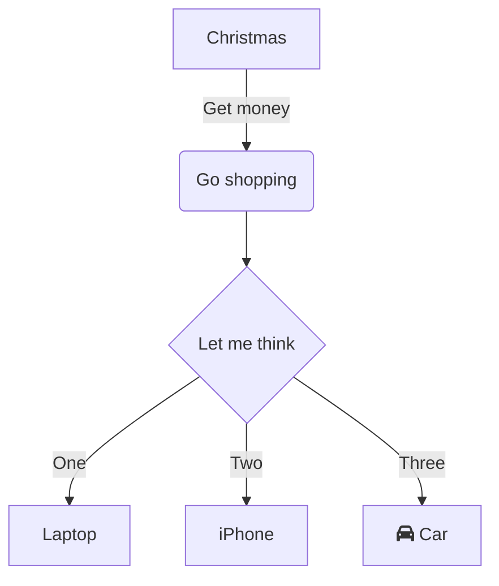
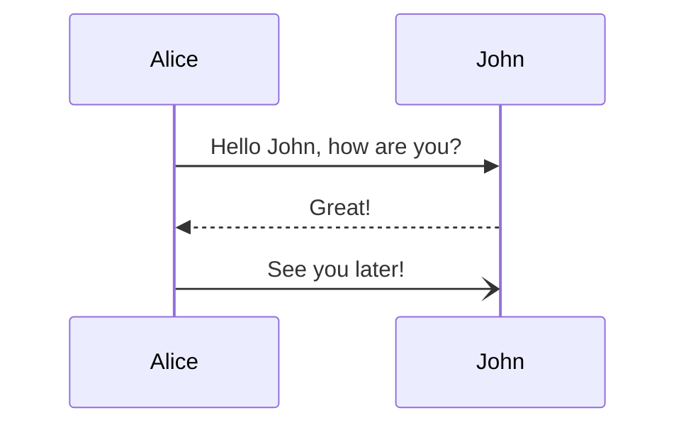

export default function Layout({children}) {
  return <div className="prose">{children}</div>;
}

# Example MDX Document w/ Extended Markdown

This document demonstrates **GitHub Flavored Markdown** and some other features you can enable with plugins.


## ✅ Task Lists

- [x] Markdown headings
- [x] Task lists
- [ ] Mermaid diagrams
- [x] Tables
- [ ] Math support


## 📊 Tables

| Feature         | Supported | Notes                |
|-----------------|:---------:|----------------------|
| Tables          | ✅        | Native to GFM        |
| Task Lists      | ✅        | `[ ]` and `[x]`      |
| Syntax Highlight| ✅        | Fenced code blocks   |
| Footnotes       | ✅        | With plugin          |
| Diagrams        | ✅        | With plugin (Mermaid)|

## Tasklist

- [ ] to do
- [x] done

## Definition List

<dl>
  <dt>Beast of Bodmin</dt>
  <dd>A large feline inhabiting Bodmin Moor.</dd>

  <dt>Morgawr</dt>
  <dd>A sea serpent.</dd>

  <dt>Owlman</dt>
  <dd>A giant owl-like creature.</dd>
</dl>

## Inline Elements
You can **bold** text, *italicize* it, <u>underline</u> it, or even add [links](/).
Here's some `inline code` too. <mark>Highlight important info</mark> and
<small>small text size</small>.
<abbr title="HyperText Markup Language">HTML</abbr> is the foundation of the web.

## Image


## Code Blocks
<div className="not-prose">
```js title="line-markers.js" del={"1":2, 5} ins={"2":3-4} {"3":6} del="text will be" "this" ins=/ye[sp]/ /me(t|n)/
function demo() {
  console.log('this line is marked as deleted')
  console.log('this is the second inserted line')
  console.log('this text will be matched')
  console.log('yep and yes are matched by regex')
  console.log('capture groups for met and men')

  return 'this line uses the neutral default marker type'
}
```
</div>

## Terminal (Shell)
<div className="not-prose">
```shell
echo "This terminal frame has no title"
```
</div>

## Terminal Output (Text)
<div className="not-prose">
```text
Output from a terminal command
```
</div>

## Command + Output
<div className="not-prose">
```shell
ls -la
```
```text
total 4
drwxr-xr-x   3 user  staff   96 Aug 15 10:00 .
drwxr-xr-x  20 user  staff  640 Aug 15 09:58 ..
-rw-r--r--   1 user  staff   42 Aug 15 10:00 file.txt
```
or (if you don't care about copying)
```shell
$ ls -la
total 4
drwxr-xr-x   3 user  staff   96 Aug 15 10:00 .
drwxr-xr-x  20 user  staff  640 Aug 15 09:58 ..
-rw-r--r--   1 user  staff   42 Aug 15 10:00 file.txt
$ ps
PID TTY          TIME CMD
540 pts/0    00:00:00 bash
25495 pts/0    00:00:00 ps
```
</div>

## Code Blocks w/ Collapsible Sections
<div className="not-prose">
```js collapse={1-5, 12-14, 21-24}
// All this boilerplate setup code will be collapsed
import { someBoilerplateEngine } from '@example/some-boilerplate'
import { evenMoreBoilerplate } from '@example/even-more-boilerplate'

const engine = someBoilerplateEngine(evenMoreBoilerplate())

// This part of the code will be visible by default
engine.doSomething(1, 2, 3, calcFn)

function calcFn() {
  // You can have multiple collapsed sections
  const a = 1
  const b = 2
  const c = a + b

  // This will remain visible
  console.log(`Calculation result: ${a} + ${b} = ${c}`)
  return c
}

// All this code until the end of the block will be collapsed again
engine.closeConnection()
engine.freeMemory()
engine.shutdown({ reason: 'End of example boilerplate code' })
```
</div>

## Autolink literals

www.example.com, https://example.com, and contact@example.com.

## Strikethrough

~one~ or ~~two~~ tildes.

## Asides

import { Admonition } from "./Admonition";

<Admonition type="note" title="Title">
    note
</Admonition>

<Admonition type="tip" title="Title">
    tip
</Admonition>

<Admonition type="caution" title="Title">
    caution
</Admonition>

<Admonition type="danger" title="Title">
    danger
</Admonition>

<Admonition type="success" title="Title">
    success
</Admonition>

## Blockquotes
> This is a blockquote.
> You can nest other markdown inside!

## Emoji
You can use emojis like 👍 and 🎉!

## - [ ] Task List in a Blockquote
> [x] This is done
> [ ] This is not done

## Footnotes
Here is a statement with a footnote.[^1]

[^1]: This is the footnote text.


import "katex/dist/katex.min.css";

## Math Block
<div className="not-prose">
    ```math
    \int_0^\infty e^{-x^2} dx = \frac{\sqrt{\pi}}{2}
    ```
</div>

## Inline Math
<div className="not-prose">
    Hello $E = mc^2$ world!
</div>

## Mermaid Diagram
<div className="not-prose">

</div>

<div className="not-prose">

</div>

## Collapsible Sections
<div className="not-prose">
    <details>
        <summary>Click to expand!</summary>
        You found the hidden section!
    </details>
</div>

## Reference
- [Basic Markdown Syntax](https://www.markdownguide.org/basic-syntax/)
- [Extended Markdown Syntax](https://www.markdownguide.org/extended-syntax/)
-
